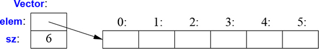

# 2 Օգտագործողի սահմանած տիպեր

_Խուճապի մի՛ մատնվեք։_

_— Դուգլաս Ադամս_

* Ներածություն
* Ստրուկտուրաներ
* Դասեր
* Միավորումներ
* Թվարկումներ
* Խորհուրդներ


## 2.1 Ներածություն

Ֆունդամենտալ (հիմնական) տիպերի (§1.4), `const` մոդիֆիկատորի (§1.6) և հայտարարման օպերատորների (§1.7) համադրումով կառոցված տիպերը կոչում ենք _ներդրված տիպեր_ (built-in types)։ C++ լեզվի ներդրված տիպերի ու գործողությունների բազմությունը բավականին հարուստ է, բայց դրանք դիտավորյալ թողնված են ցածր մակարդակում։ Դրանք ուղղակիորեն և արդյունավետորեն արտացոլում են սովորական կոմպյուտերի ապարատային հնարավորությունները։ Այնուամենայնիվ, դրանք ծրագրավորողին չեն տրամադրում բարդ ծրագրեր գրելու համար անհրաժեշտ բարձր մակարդակի հնարավորություններ։ Փոխարենը C++ լեզուն ներդրված տիպերն ու գոծողությունները լրացնում է _աբստրակցիայի մեխանիզմների_ համապատասխան բազմությամբ, որից ծրագրավորողները կարող են ստեղծել անհրաժեշտ բարձր մակարդակի միջոցները։ ??

C++ լեզվի աբստրակցիայի մեխանիզմներն առաջին հերթին մշակվել են, որպեսզի ծրագրավորողներին հնարավորություն տրվի մշակել և իրականացնել իրենց սեփական տիպերը՝ համապատասխան ներկայացմամբ և գործողություններով, և որպեսզի ծրագրավորողները կարողանան հեշտությամբ ու նրբորեն օգտագործեն այդ տիպերը։ C++-ի աբստրակցիաների մեխանիզմներով այլ տիպերից կառուցված տիպերը կոչվում են _օգտագործողի սահմանած տիպեր_։ Դրանք հիշատակվում են որպես _դասեր_ և _թվարկումներ_։ ?? Օգտագործողի սահմանած տիպերը կարող են կառուցվել ինչպես ներդրված տիպերից, այնպես էլ օգտագործողի սահմանած այլ տիպերից։ Այս գրքի մեծ մասը նվիրված է օգտագործողի կողմից սահմանված տիպերի մշակմանը, իրականացմանը և օգտագործմանը։ Օգտագործողի սահմանած տիպերը հաճախ նախընտրելի են ներդրված տիպերից, քանի որ դրանց օգտագործումն ավելի պարզ է, ավելի քիչ է սխալների հնարավորությունը, և, որպես կանոն, նույքան արդյունավետ է, որքան ներդրված տիպերի օգտագործումը, միգուցե նաև ավելի արագ։ ??

Այս գլխի շարունակությունը նկարագրում է տիպերի սահմանման և օգտագործման պարզագույն և ամենահիմնարար հնարավորությունները։ 4-7֊րդ գլուխները պարունակում են աբստրակցիայի մեխանիզմների և դրանցով ապահովված ծրագրավորման ոճերի առավել լրիվ նկարագրությունը։ 8-15֊րդ գլուխները ներածություն են ստանդարտ գրադարանի հնարավորություններին, և քանի որ ստանդարտ գրադարանը հիմնականում բաղկացած է օգտագործողի սահմանած տիպերից, այդ գլուխներում բերված են օրինակներ, թե ինչ է հնարավոր կառուցել 1-7-րդ գլուխներում նկարագրված լեզվական միջոցների և ծրագրավորման տեխնիկաների օգտագործմամբ։ ??


## 2.2 Ստրուկտուրաներ

Հաճախ նոր տիպ կառուցելու առաջին քայլը նրան անհրաժեշտ տարրերի ընդգրկումն է տվյալների կառուցվածքի՝ ստրուկտուրայի (`struct`) մեջ.

```C++
struct Vector {
    int sz;          // տարրերի քանակը
    double* elem;    // ցուցիչ տարրերի վրա
};
```

`Vector`֊ի այս նախնական տարբերակը բաղկացած է `int` տիպի և `double*` տիպի տարրերից։

`Vector` տիպի փոփոխականը կարող է սահմանվել հետևյալ կերպ․

```C++
Vector v;
```

Այնուամենայնիվ, սրանից շատ օգուտ չկա, քանի որ `v`֊ի `elem` ցուցիչը ոչ մի բանի ցույց չի տալիս։ Որպեսզի այն օգտակար լինի, մենք պետք է `v`-ին տանք ինչ-որ տարրեր, որոնց վրա այն ցույց կտա։ Օրինակ, `Vector`֊ը մենք կարող ենք կառուցել հետևյալ ձևով․

```C++
void vector_init(Vector& v, int s)
{
    v.elem = new double[s];   // ստեղծել s հատ double տիպի թվերի զանգված
    v.sz = s;
}
```

Ահա, `v`֊ի `elem` անդամն ստանում է ցուցիչ՝ ստեղծված `new` օպերատորի կողմից և `v`֊ի `sz` անդամն ստանում է տարրերի քանակը։ `Vector&` գրառման `&`-ը ցույց է տալիս, որ `v`֊ն մենք փոխանցում ենք որպես ոչ-`const` հղում (§1.7), այդ ձևով `vector_init()` ֆունկցիան կարող է փոփոխություններ անել իրեն փոխանցված վեկտորի հետ։

`new` օպերատորը հիշողություն է առանձնացնում այն տարածքից, որը կոչվում է _ազատ տարածք_ (հայտնի է նաև որպես _դինամիկ հիշողություն_ և _heap_)։ Ազատ տարածքում տեղադրված օբյեկտներն անկախ են այն տեսանելիության տիրույթից, որտեղ ստեղծվել են և «ապրում» են, քանի դեռ չեն ոչնչացվել `delete` հրամանով (§4.2.2)։

`Vector`֊ի մի պարզ կիրառում ունի հետևյալ տեսքը․

````C++
double read_and_sum(int s)
    // կարդալ s ամբողջ թվերը cin֊ից և վերադարձնել նրանց գումարը;
    // ենթադրվում է, որ s-ը պետք է լինի դրական թիվ
{
    Vector v;
    vector_init(v,s);           // առանձնացնել s հատ տարր v-ի համար
    for (int i=0; i!=s; ++i)
        cin >> v.elem[i];       // կարդալ տարրերի մեջ

    double sum = 0;
    for (int i=0; i!=s; ++i)
        sum+=v.elem[i];       // ստանալ տարրերի գումարը
    return sum;
}
````

Գեղեցիկ և ճկուն դառնալու համար, ինչպիսին որ ստանդարտ գրադարանի `vector`֊ն է, մեր `Vector`֊ը դեռ երկար ճանապարհ պիտի անցնի։ Մասնավորապես, `Vector`-ի օգտագործողը պետք է իմանա `Vector`֊ի նկարագրության յուրաքանչյուր մասնիկը։ Այս գլխի մնացած մասը և հաջորդ երկու գլուխները աստիճանաբար զարգացնում են `Vector`֊ը, որպես լեզվի հնարավորությունների և տեխնիկական հնարքների օրինակ։ Գլուխ 11-ը ներկայացնում է ստանդարտ գրադարանի `vector`֊ը, որը պարունակում է բազմաթիվ գեղեցիկ բարելավումներ։

`vector`֊ը և ստանդարտ գրադարանի մյուս բաղադրիչները ես օգտագործում եմ որպես օրինակներ, որպեսզի.
* ցուցադրեմ լեզվական հնարավորություններն ու դիզայնի տեխնիկան, և
* օգնեմ ձեզ սովորել և օգտագործել ստանդարտ գրադարանի բաղադրիչները։

Նորից մի՛ հորինեք ստանդարտ գրադարանի բաղադրիչներն, ինչպիսիք են `vector`֊ը և `string`֊ը, օգտագործեք դրանք։

We use . (dot) to access struct members through a name (and through a reference) and −> to access struct members through a pointer. For example:

Մենք `.`-ը (կետ) օգտագործում ենք `struct`֊ի անդամներին անվան (և հղման) միջոցով դիմելու համար, իսկ `->` նշանը՝ `struct`֊ի անդամներին ցուցիչով դիմելու համար։ Օրինակ․

````C++
void f(Vector v, Vector& rv, Vector* pv)
{
    int i1 = v.sz;       // դիմում անվան միջոցով
    int i2 = rv.sz;      // դիմում հղման միջոցով
    int i4 = pv->sz;     // դիմում ցուցիչի միջոցով
}
````


## 2.3 Դասեր

A class has a set of members, which can be data, function, or type members.

Տվյալների և դրանց համար սահմանված գործողությունների առանձին սահմանումն ունի իր առավելությունը, ինչպես տվյալների տարբեր եղանակով օգտագործելը։ Սակայն տվյալների ներկայացման և գործողությունների միջև ավելի սերտ կապը օգտագործողի սահմանած տիպին անհրաժեշտ է «իսկական տիպին» յուրահատուկ բոլոր հատկություններն ունենալու համար։ ?? Մասնավորապես, հաճախ ցանկանում ենք տվյալների ներկայացումն անհասանելի պահել օգտագործողներին, դրանով պարզեցնելով օգտագործումը, երաշխավորելով տվյալների անսխալ օգտագործումը, և մեզ հնարավորություն տալով հետագայում բարելավել ներկայացումը։ ?? Դա անելու համար պետք է տարանջատենք տիպի ինտերֆեյսը (որ հասանելի է բոլորին) և նրա իրականացումը (որին մատչելի են այլ եղանակով անհասանելի տվյալները)։ ?? Ասվածն ապահովող լեզվական մեխանիզմը կոչվում է _դաս_ (_class_)։ Դասն ունի անդամներ (members), որոնք կարող են լինել տվյալներ, ֆունկցիաներ կամ տիպեր։ Ինտերֆեյսը որոշվում է դասի `public` անդամներով, իսկ `private` անդամները հասանելի են միայն այդ ինտերֆեյսով։ Օրինակ․

````C++
class Vector {
public:
     Vector (int s) :elem{new double[s]}, sz{s} {}   //կառուցում ենք Vector֊ը
     double& operator[](int i) { return elem[i]; }   // դիմում էլեմենտին՝ ինդեքսավորում
     int size() { return sz; }
private:
     double* elem   // էլեմենտների ցուցիչը
     int sz;        // էլեմենտների քանակը
};
````

Սա ունենալով մենք կարող ենք սահմանել մեր նոր `Vector` տիպի փոփոխական.

```C++
Vector v(6);      // վեկտոր 6 տարրերով
```

`Vector` օբյեկտը գրաֆիկորեն կարող ենք ներկայացնել այսպես․



This is the basic technique for handling varying amounts of information in C++: a fixed-size handle referring to a variable amount of data “elsewhere” (e.g., on the free store

Պարզ ասած՝ `Vector` օբյեկտը տարրերի ցուցիչը (`elem`) և տարրերի քանակը (`sz`) պահող մի «handle» ?? է։ Տարրերի քանակը (օրինակի մեջ 6 է) տարբեր `Vector` օբյեկտներում կարող են տարբեր լինել, իսկ նույն `Vector` օբյեկտը ժամանակի տարբեր պահերին կարող է ունենալ տարբեր քանակի տարրեր (§4.2.3)։ Սակայն ինքը `Vector` օբյեկտը միշտ նույն չափն ունի։ Սա է C++֊ում փոփոխական քանակի ինֆորմացիայի հետ աշխատելու հիմնական տեխնիկան. հաստատուն չափի handle, ?? որ հղվում է «մեկ այլ տեղում» գտվող փոփոխական չափի տվյալների (օր., հիշողության դինամիկ տիրույթում՝ ընտրված `new`-ի միջոցով; §4.2.2)։ Չորրորդ գլիխի հիմնական թեման է՝ թե ինչպես նախագծել և օգտագործել այդպիսի օբյեկտները։

Here, the representation of a Vector (the members elem and sz) is accessible only through the interface provided by the public members: Vector(), operator[](), and size(). The read_and_sum() example from §2.2 simplifies to:

Այստեղ `Vector`֊ի ներկայացումը (`elem` և  `sz` անդամները) հասանելի է միայն `public` անդամներով որոշված ինտերֆեյսով․ `Vector()`, `operator[]()` և `size()`։ §2.2֊ից `read_and_sum()` օրինակը պարզեցվում է հետևյալ ձևով․

````C++
double read_and_sum (int s)
{
     Vector v(s);                                    // ստեղծվում է s տարրերի վեկտոր
     for (int i=0; i!=v.size(); ++i)
        cin >> v[i];                                 // կարդում ենք տարրերի մեջ

     double sum = 0;
     for (int i=0; i!=v.size(); ++i)
        sum+=v[i];                                 // ստանում ենք տարրերի գումարը
     return sum;
}
````

Իր դասի անունով «ֆունկցիան», կոչվում է _կոնստրուկտոր_, սա այն ֆունկցիան է, որն օգտագործվում է դասի օբյեկտները կառուցելու համար։ Այսպիսով, `Vector()` կոնստրուկտորը փոխարինում է `vector_init()`֊ին §2.2֊ից։ Ի տարբերություն սովորական ֆունկցիայի, կոնստրուկտորը երաշխավորվում է լինել օգտագործված իր դասի օբյեկտներն արժեքավորելու համար։ Հետևաբար, սահմանելով կոնստրուկտորը, վերանում է դասի համար ոչ արժեքավորված փոփոխականների խնդիրը։

`Vector(int)`֊ը սահմանում է, թե ինչպես է կառուցվում `Vector` տիպի օբյեկտը։ Դա անելու համար մասնավորապես այն հաղորդում է, որ իրեն անհրաժեշտ է ամբողջ թիվ։ Ամբողջ թիվն օգտագործվում է որպես տարրերի քանակ։ Կոնստրուկտորն արժեքավորում է `Vector`֊ի անդամները՝ օգտագործելով անդամների արժեքավորման ցուցակը․

````C++
:elem {new double[s]}, sz{s}
````

Սա նշանակում է, որ սկզբում մենք `elem`֊ին տալիս ենք ցուցիչ `double` տիպի `s` տարրերի վրա, որը ձեռք է բերված ազատ տարածքում։ Հետո արժեքավորում ենք ենք `sz`֊ն `s`֊ով։

Դիմումը տարրերին ապահովվում է ինդեքսավորման ֆունկցիայով, որը կոչվում է `operator[]`: Այն վերադարձնում է համապատասխան տարրի հղումը (`double&`)։

`size()` ֆունկցիան տրամադրված է, որպեսզի օգտագործողին տա տարրերի քանակը։

Ակնհայտ է, որ սխալների մշակումը բացակայում է ամբողջությամբ, բայց մենք կվերադառնանք դրան §3.4֊ում։ Նմանապես, մենք չենք ապահովում մեխանիզմ, որը «հետ կստանա» `new`-ով ստացված `double`ների զանգվածը; §4.2.2֊ը ցույց է տալիս, թե ինչպես օգտագործել դեստրուկտորը՝ գեղեցիկ կերպով դա անելու համար։

Չկա ոչ մի ֆունդամենտալ տարբերություն `struct`֊ի և `class`֊ի միջև; `struct`֊ը պարզապես `class`է՝ լռությամբ `public` անդամներով։ Օրինակ, դուք կարող եք  սահմանել կոնստրուկտորներ և ուրիշ անդամ֊ֆունկցիաներ `struct`֊ի համար։


##2.4 Միավորումներ

`Միավորումը` (`union`) այն `տվյալների կառուցվածքն է` (`a struct`), որի մեջ բոլոր անդամները տեղավորված են հիշողության մեջ միևնույն հասցեում, այսպիսով `միավորումը` զբաղեցնում է միայն այնքան տարածք, ինչքան որ իր ամենամեծ անդամը։ Բնականաբար `միավորումը` միաժամանակ կարող է պահել միայն մեկ անդամի արժեքը։ Օրինակ, դիտարկենք սիմվոլի մուտքագրման աղյուսակը, որն իր մեջ պահում է անուն և արժեք․

````C++
enum Type {str, num};

struct Entry {
       char* name;
       Type t;
       char* s;       // օգտագործել s-ը, եթե t==str
       int i;             // օգտագործել i֊ն, եթե t==num
};

void f(Entry* p)
{
       if (p->t == str)
               cout << p->s;
        // ...
}
````

`s` և `i` անդամները երբեք չեն կարող օգտագործվել միևնույն ժամանակ, հետևաբար տարածքն զբաղեցրած է անտեղի։ Սա կարող ենք նորից գրել՝ սահմանելով `s` և `i` փոփոխականները որպես `միավորման` անդամներ հետևյալ կերպ․

````C++
union Value {
      char* s;
      int i;
};
````

Լեզուն չի հետևում, թե որ արժեքն է պահվում `միավորման` կողմից, այնպես, որ դա պետք է անի ծրագրավորողը․

````C++
struct Entry {
       char* name;
       Type t;
       Value v;          // օգտագործել v.s արժեքը, եթե t==str; օգտագործել v.i, եթե t==num
};

void f(Entry* p)
{
       if (p->t == str)
                cout << p->v.s
       // ...
}
````

Maintaining the correspondence between a *type field* (here, `t` ) and the type held in a `union` is errorprone. To avoid errors, one can encapsulate a union so that the correspondence between a type field and access to the union members is guaranteed. At the application level, abstractions relying on such tagged unions are common and useful, but use of ‘‘naked’’ union s is best minimized.


## 2.5 Թվարկումներ

C++ լեզուն դասերին ավելացնում է  օգտագործողի սահմանած տիպի մեկ պարզ ձև, որի համար մենք կարող ենք թվարկել արժեքներ․

````C++
 enum class Color {red, blue, green};
 enum class Traffic_light {green, yellow, red};

 Color col = Color::red;
 Traffic_light light = Traffic_light::red;
````

Նշենք, որ թվարկված արժեքները (օր․ `red`) գտնվում են իրենց `enum class`֊ի տեսանելիության տիրույթում, հետևաբար նրանք կարող են բազմիցս օգտագործվել  տարբեր `enum class`֊երի մեջ՝ առանց շփոթություն առաջացնելու։ Օրինակ `Color::red` արժեքը `Color`֊ի `red` արժեքն է, որը տարբերվում է `Traffic_light::red` արժեքից։

Թվարկումներն օգտագործվում են ամբողջ թվերի փոքր խմբեր ներկայացնելու համար։ Դրանք օգտագործվում են կոդն ավելի ընթեռնելի դարձնելու համար և ավելի քիչ են ենթարկվում սխալների than it would have been had the symbolic (and mnemonic) enumerator names not been used.

`class` անունը `enum`֊ից հետո ցույց է տալիս, որ թվարկման տիպը խստորեն որոշված է և նրա թվարկված արժեքներն ունեն իրենց տեսանելիության տիրույթը։ Լինելով առանձնացված տիպեր `enum class`֊երն օգնում են կանխել հաստատունների պատահական սխալ գործածությունը։ Մասնավորապես մենք չենք կարող շփոթել `Traffic_light`֊ի և `Color`֊ի արժեքները․

````C++
Color x= red;                    // սխալ է․ պետք է նշել, թե որ red արժեքն է
Color y = Traffic_light::red;    // սխալ է․ սա Color֊ի red արժեքը չէ
Color z = Color::red;            // ճիշտ է
````

Նմանապես, չենք կարող խառնել `Color` թվարկման արժեքները և ամբողջ թվերը․

````C++
int i = Color::red;              // սխալ է․ Color::red֊ը ամբողջ թիվ չէ
Color c = 2;                     // սխալ է․ 2-ը Color չէ
````

Լռությամբ `enum class`֊ն ունի սահմանված հավասարության, ինիցիալիզացիայի և համեմատության գործողությունները (օր․`==` և `<`; §1.5)։ Սակայն թվարկումն օգտագործողի կողմից սահմանված տիպ է, հետևաբար մենք ինքներս կարող ենք նրա համար սահմանել  օպերատորներ․

````C++
Traffic_light& operator++(Traffic_light& t)
       // նախածանցային ինկրեմենտ՝ ++
{
        switch(t){
        case Traffic_light::green:      return t = Traffic_light::yellow;
        case Traffic_light::yellow;      return t = Traffic_light::red;
        case Traffic_light::red;           return t = Traffic_light::green;
        }
}

Traffic_light next = ++light;
````

Եթե չեք ցանկանում խստորեն նշել թվարկման անունները և ուզում եք, որ արժեքները լինեն `ամբողջ`ներ (առանց բացահայտ ձևափոխման), դուք կարող եք հեռացնել  `class` անունը `enum class`֊ից՝ ստանալու համար «պարզ» `թվարկում` (`enum`): «Պարզ» `թվարկման` թվարկված անունները մուտքագրվում են տեսանելիության միևնույն տիրույթում, որտեղ, որ իրենց  `թվարկման` անունն է և ոչ ակնհայտորեն ձևափոխվում են իրենց ամբողջ արժեքներին։ Օրինակ․

````C++
enum Color {red, green, blue};
int col = green;
````

Այստեղ `col`֊ը ստանում է `1` արժեքը։ Լռությամբ թվարկվող անունների ամբողջ արժեքներն սկսում են `0`֊ից և ավելանում են մեկով յուրաքանչյուր թվարկվող անվան հետ։ «Հասարակ» `թվարկումները` եղել են C++-ում (և C-ում) ամենավաղ օրերից, և թեև նրանց վարքը այնքան էլ լավը չէ, դրանք ընթացիկ կոդերում էլ գործածելի են։


## 2.6 Խորհուրդներ

1. Այս գլխի նյութը մոտավորապես համապատասխանում է [Stroustrup,2013] գրքի, 8֊րդ գլխում շատ ավելի մանրամասն շարադրված նյութին։
2. Իրար հետ կապ ունեցող տվյալները համակարգեք տվյալների կառուցվածքի մեջ (`տվյալների կառուցվածքներ` կամ `դասեր`); §2.2։
3. Represent the distinction between an interface and an implemetation using a class ; §2.3.
4. `Տվյալների կառուցվածքը` նույն `դասն` է լռությամբ `public` անդամներով; §2.3։
5. Սահմանեք կոնստրուկտորներ, որպեսզի պարզեցվի և երաշխավորվի `դասերի` ինիցիալիզացիան։
6. Խուսափե՛ք «միայնակ» `միավորումներից`; շրջափակեք դրանք դասով ?; §2.4:
7. Օգտագործե՛ք թվարկումները անվանված հաստատունների խումբ ներկյացնելու համար; §2.5
8. Նախընտրե՛ք `class enum` թվարկումները «հասարակ» `թվարկումներից`, անսպասելի դեպքերը քչացնելու համար; §2.5:
9. Սահմանեք գործողություններ թվարկուների վրա՝ ապահով և պարզ օգտագործման համար; §2.5:
